---
## Front matter
title: "Отчёт по лабораторной работе №5"
subtitle: "Архитектура компьютеров и операционные системы"
author: "Баранов Кирилл Андреевич НБИбд-01-23"

## Generic otions
lang: ru-RU
toc-title: "Содержание"

## Bibliography
bibliography: bib/cite.bib
csl: pandoc/csl/gost-r-7-0-5-2008-numeric.csl

## Pdf output format
toc: true # Table of contents
toc-depth: 2
lof: true # List of figures
lot: true # List of tables
fontsize: 12pt
linestretch: 1.5
papersize: a4
documentclass: scrreprt
## I18n polyglossia
polyglossia-lang:
  name: russian
  options:
	- spelling=modern
	- babelshorthands=true
polyglossia-otherlangs:
  name: english
## I18n babel
babel-lang: russian
babel-otherlangs: english
## Fonts
mainfont: PT Serif
romanfont: PT Serif
sansfont: PT Sans
monofont: PT Mono
mainfontoptions: Ligatures=TeX
romanfontoptions: Ligatures=TeX
sansfontoptions: Ligatures=TeX,Scale=MatchLowercase
monofontoptions: Scale=MatchLowercase,Scale=0.9
## Biblatex
biblatex: true
biblio-style: "gost-numeric"
biblatexoptions:
  - parentracker=true
  - backend=biber
  - hyperref=auto
  - language=auto
  - autolang=other*
  - citestyle=gost-numeric
## Pandoc-crossref LaTeX customization
figureTitle: "Рис."
tableTitle: "Таблица"
listingTitle: "Листинг"
lofTitle: "Список иллюстраций"
lotTitle: "Список таблиц"
lolTitle: "Листинги"
## Misc options
indent: true
header-includes:
  - \usepackage{indentfirst}
  - \usepackage{float} # keep figures where there are in the text
  - \floatplacement{figure}{H} # keep figures where there are in the text
---

# Цель работы

Целью работы является приобретение практических навыков работы в Midnight Commander. 
Освоение инструкций языка ассемблера mov и int.

# Выполнение лабораторной работы

1. Я открыл Midnight Commander и перешел в каталог ~/work/arch-pc. Создал новый каталог под названием lab05.

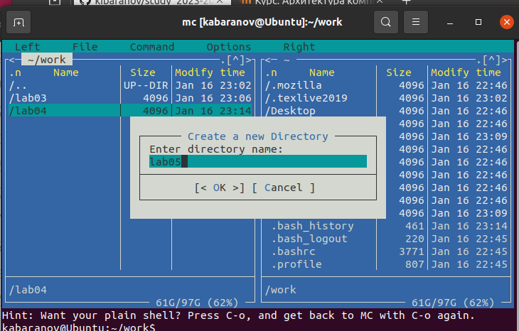{ #fig:001 width=70%, height=70% }

2. Внутри каталога lab05 я создал файл lab05-1.asm. Затем я открыл этот файл для редактирования и начал писать код.

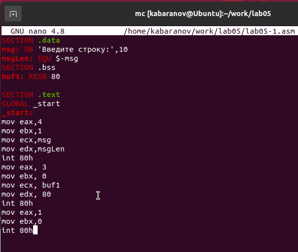{ #fig:002 width=70%, height=70% }

3. Я также открыл файл lab05-1.asm для просмотра и проверил, что код был написан правильно.

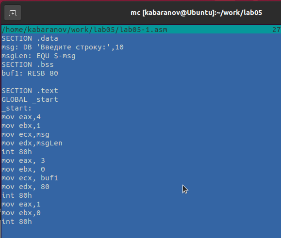{ #fig:003 width=70%, height=70% }

4. После того, как я получил исполняемый файл из кода, я проверил его работу, чтобы убедиться, что все функционирует должным образом.

{ #fig:004 width=70%, height=70% }

5. Я скачал файл in_out.asm и добавил его в рабочий каталог. Затем я скопировал содержимое файла lab05-1.asm в новый файл под названием lab05-2.asm.

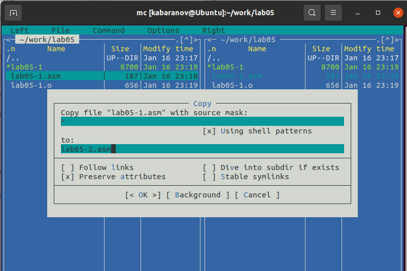{ #fig:005 width=70%, height=70% }

6. В файле lab05-2.asm я написал код программы. После этого я скомпилировал программу и проверил ее запуск.

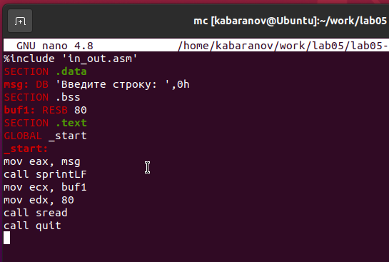{ #fig:006 width=70%, height=70% }

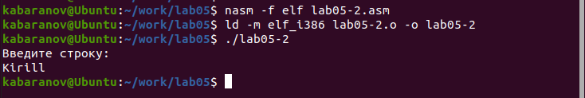{ #fig:007 width=70%, height=70% }

7. Внутри файла lab05-2.asm я заменил подпрограмму sprintLF на sprint. Затем я пересобрал исполняемый файл. Теперь при выводе строки нет перехода на следующую строку.

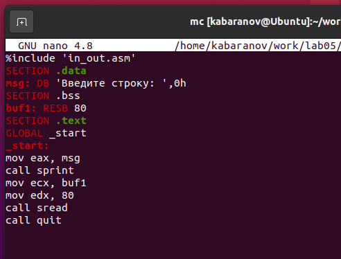{ #fig:008 width=70%, height=70% }

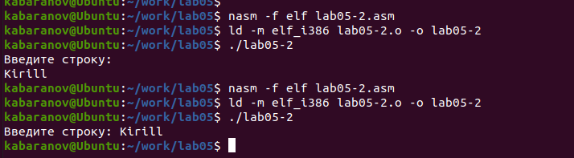{ #fig:009 width=70%, height=70% }

8. Я скопировал программу lab05-1.asm и изменил код так, чтобы сначала выводилось приглашение "Введите строку:", затем пользователь вводил строку с клавиатуры, и введенная строка выводилась на экран.

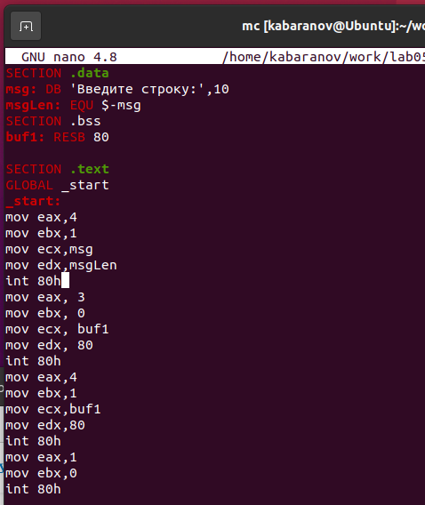{ #fig:010 width=70%, height=70% }

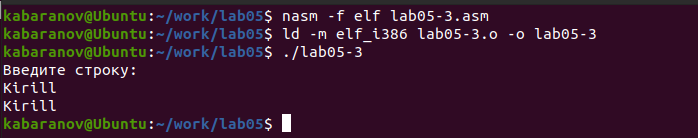{ #fig:011 width=70%, height=70% }

9. Затем я скопировал программу lab05-2.asm и выполнил аналогичные действия, описанные выше, но теперь использовал возможности из файла in_out.asm.

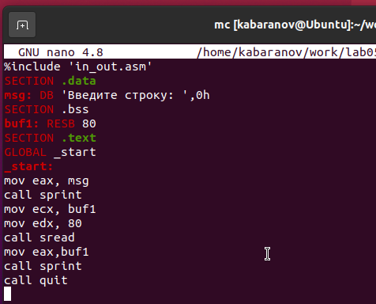{ #fig:012 width=70%, height=70% }

{ #fig:013 width=70%, height=70% }

# Выводы

Научились писать базовые ассемблерные программы. Освоили ассемблерные инструкции mov и int.